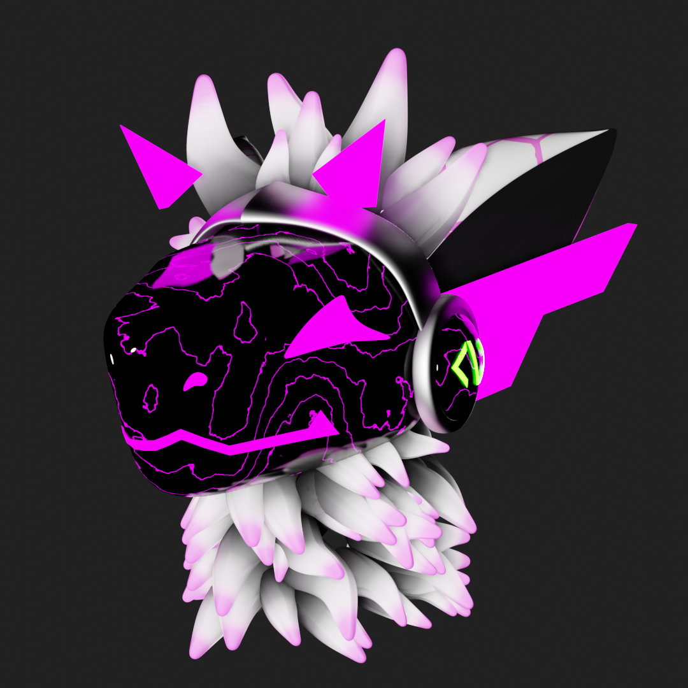

<!-- Improved compatibility of back to top link: See: https://github.com/othneildrew/Best-README-Template/pull/73 -->
<a id="readme-top"></a>
<!--
*** Thanks for checking out the Best-README-Template. If you have a suggestion
*** that would make this better, please fork the repo and create a pull request
*** or simply open an issue with the tag "enhancement".
*** Don't forget to give the project a star!
*** Thanks again! Now go create something AMAZING! :D
-->


<!-- PROJECT SHIELDS -->
<!--
*** I'm using markdown "reference style" links for readability.
*** Reference links are enclosed in brackets [ ] instead of parentheses ( ).
*** See the bottom of this document for the declaration of the reference variables
*** for contributors-url, forks-url, etc. This is an optional, concise syntax you may use.
*** https://www.markdownguide.org/basic-syntax/#reference-style-links
-->
[![Contributors][contributors-shield]][contributors-url]
[![Forks][forks-shield]][forks-url]
[![Stargazers][stars-shield]][stars-url]
[![Issues][issues-shield]][issues-url]
[![project_license][license-shield]][license-url]


<!-- PROJECT LOGO -->
<br />
<div align="center">
  <a href="https://github.com/RileyPersonne/inactivity-bot">
    
  </a>

<h3 align="center">Inactivity Bot</h3>

  <p align="center">
    ValBot
    <br />
    &middot;
    <a href="https://github.com/RileyPersonne/inactivity-bot/issues/new?labels=bug&template=bug-report---.md">Report Bug</a>
    &middot;
    <a href="https://github.com/RileyPersonne/inactivity-bot/issues/new?labels=enhancement&template=feature-request---.md">Request Feature</a>
  </p>
</div>


<!-- TABLE OF CONTENTS -->
<details>
  <summary>Table of Contents</summary>
  <ol>
    <li>
      <a href="#about-the-project">About The Project</a>
      <ul>
        <li><a href="#built-with">Built With</a></li>
      </ul>
    </li>
    <li>
      <a href="#getting-started">Getting Started</a>
      <ul>
        <li><a href="#prerequisites">Prerequisites</a></li>
        <li><a href="#installation">Installation</a></li>
      </ul>
    </li>
    <li><a href="#usage">Usage</a></li>
    <li><a href="#license">License</a></li>
    <li><a href="#contact">Contact</a></li>
  </ol>
</details>


<!-- ABOUT THE PROJECT -->
## About The Project

A discord bot created for the Queerest least known and best trans weekly movie night
<p align="right">(<a href="#readme-top">back to top</a>)</p>


### Built With

* [![Python][Python]][Python]

<p align="right">(<a href="#readme-top">back to top</a>)</p>


<!-- GETTING STARTED -->
## Getting Started

This is an example of how you may give instructions on setting up your project locally.
To get a local copy up and running follow these simple example steps.

### Prerequisites

This is an example of how to list things you need to use the software and how to install them.
* install Python
  * for further info follow this tutorial https://wiki.python.org/moin/BeginnersGuide/Download

### Installation

1. Follow discord's install guide to get started [https://discordpy.readthedocs.io/en/stable/intro.html#installing](https://discordpy.readthedocs.io/en/stable/intro.html#installing)
2. Clone the repo
   ```sh
   git clone https://github.com/RileyPersonne/inactivity-bot.git
   ```
3. Create .env file
4. Enter token into .env file
    ```js
   TOKEN=your.token.here
    ```
5. Run bot
    ```sh
    python3 bot.py
    ```
<p align="right">(<a href="#readme-top">back to top</a>)</p>


<!-- USAGE EXAMPLES -->
## Usage
to summon the bot send a message starting with one of the commands listed below

<strong>commands:</strong>

    $activity

reads through the past 6000 messages in general chat, and 250 messages in each other chat and compiles the time stamps of the last message from each user, before dm-ing a txt file with: the day of the oldest surveyed message, and a table of each username and the days since the last sent message

    $hello valbot
responds politely
<p align="right">(<a href="#readme-top">back to top</a>)</p>

<!-- LICENSE -->
## License

Distributed under the Unlicense License. See `LICENSE.txt` for more information.

<p align="right">(<a href="#readme-top">back to top</a>)</p>


<!-- CONTACT -->
## Contact

Valerie - [@ellagabalus](https://discordapp.com/users/723728393476112405)

Project Link: [https://github.com/RileyPersonne/inactivity-bot](https://github.com/RileyPersonne/inactivity-bot)

<p align="right">(<a href="#readme-top">back to top</a>)</p>

<!-- MARKDOWN LINKS & IMAGES -->
<!-- https://www.markdownguide.org/basic-syntax/#reference-style-links -->
[contributors-shield]: https://img.shields.io/github/contributors/RileyPersonne/inactivity-bot.svg?style=for-the-badge
[contributors-url]: https://github.com/RileyPersonne/inactivity-bot/graphs/contributors
[forks-shield]: https://img.shields.io/github/forks/RileyPersonne/inactivity-bot.svg?style=for-the-badge
[forks-url]: https://github.com/RileyPersonne/inactivity-bot/network/members
[stars-shield]: https://img.shields.io/github/stars/RileyPersonne/inactivity-bot.svg?style=for-the-badge
[stars-url]: https://github.com/RileyPersonne/inactivity-bot/stargazers
[issues-shield]: https://img.shields.io/github/issues/RileyPersonne/inactivity-bot.svg?style=for-the-badge
[issues-url]: https://github.com/RileyPersonne/inactivity-bot/issues
[license-shield]: https://img.shields.io/github/license/RileyPersonne/inactivity-bot.svg?style=for-the-badge
[license-url]: https://github.com/RileyPersonne/inactivity-bot/blob/master/LICENSE.txt
[Python]: https://img.shields.io/badge/python-3670A0?style=for-the-badge&logo=python&logoColor=ffdd54
[Python-url]: https://python.org/